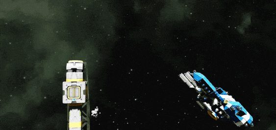
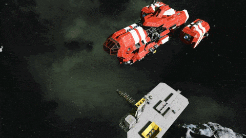

# Autodocking-2
A script for Space Engineers that will automatically control and dock your in-game ship to a home connector.

## The Shiny New Version
After not being able to maintain version 1 for a while, when I came back, it was a buggy mess. Even without the bugs there were flaws in the base code. Because of this, I decided to totally rewrite it with a new system.

This new version has an accurate model of the ship thrusts, and will use this to calculate the maximum possible acceleration in a direction. Knowing the maximum acceleration allows the ship to know when to apply reverse thrust. And so it can safely boost toward the target connector knowing exactly when it'll have to do a reverse burn.

This is different to version 1, because version 1 did not know any of this. It simply accelerated by some arbitrary amount until an arbitrary top speed, then took a guess at when it should probably decelerate. As you can guess, this lack of a model caused issues.

My rotation code was also buggy. When the ship was very far from the (0,0,0) world coordinate, the numbers got large enough to have floating point issues. For this reason I changed my method and also introduced some of Whiplash's code. He wrote a great PID controller which I repurposed to control my pitch, yaw and roll.

My old script had some great bugfixes from the community. I am glad they could spend the time looking through the code to find the fixes, and help others out with it. I think the Sparks of the Future update may have broken these for good though.

## Limitations
Because this version was recently programmed, I prioritised code quality and reliability over features. I believe this was the right call, however features are still important, especially since my version 1 currently has more features than version 2.

The upcoming features are highlighted in the To-do section of this readme.

Code limitations include the unnecesary use of memory allocation. At some point I plan to go through and change a load of local variables to global ones. While this will make it less readable, the trade-off is a good one.

More comments need to be added. I'm aware my last script had lots of people looking through it, so I'd like to provide these with a nice readable set of code.

It's not as customizable as I'd like - There's only 7 changeable parameters. These can't be changed using the "Custom Data" field of the programming block either which is pretty standard in most scripts.

Testing - while I have tested this on a fair amount of ships, I am but a one-man-band. This game allows players to create a huge variety of ships, I fear the boundaries of what I have thought up will be pushed too far by people.

## Showcase Video

## To-do
- Landing on moving ships.
- Waypointed landings.
- Fix breakneck speed overshoot issue.
- Add remote control collision avoidance.
- Add option for rotating as it lowers onto connector.
- Look up how to calculate gyro spin speed, ready for flip-and-burn.
- Add "API" - activate timer with tag, once docked.
- Allow not all 6 directions having thrust.
- Allow clearing of memory.